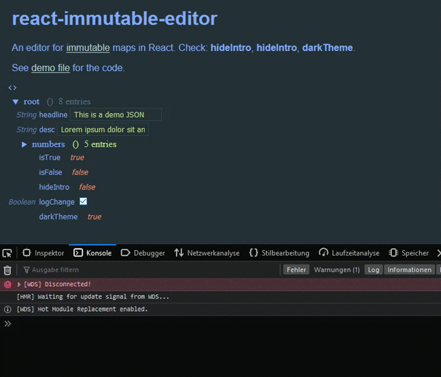

# React Immutable Editor

An editor for [immutable-js](https://immutable-js.github.io/immutable-js/docs/#/") maps in React, hacked around [react-json-tree](https://www.npmjs.com/package/react-json-tree) for debugging of immutables.



Try it yourself:

1. Download git repo: `git clone https://bitbucket.org/bemit_eu/react-immutable-editor.git`
2. Install demo setup: `npm i`
3. Start server: `npm start`
4. Visit shown URL, default [localhost:3000](http://localhost:3000)
5. Check [demo/src/index.js](demo/src/index.js)

Install it in your project: `npm i --save-dev react-immutable-editor`

## Minimal Example

```js
import React from 'react';
import {ImmutableEditor, themeMaterial} from 'react-immutable-editor';
import {OrderedMap} from "immutable";

/**
 * Get your data in an ordered map in an upper component that handles it as state
 * @var {OrderedMap} demoData
 */

const ThemedImmutableEditor = (props) => <ImmutableEditor
    theme={themeMaterial} // any BASE16 style, not optional!
    invertTheme={false}// useful for default `dark/light` theme
    
    data={props.data}// pass your immutable
    
    // `keys` is an array that can be used for .getIn and .setIn
    // val is the data that was changed
    onChange={(keys, val) => { /* update your demoData */ props.setData(keys, val) }}
    getVal={keys => { /* get your demo data */ return props.getVal(keys); }}/>

export {ThemedImmutableEditor}
```

See [demo file](https://bitbucket.org/bemit_eu/react-immutable-editor/src/master/demo/src/index.js) for the full React example.

## Type Support

Currently those types are supported:

As input any immutable is valid (e.g. `Map`, `List`), or anything that implements `toJS` like immutable and is compatible with `react-json-tree`.

Editing map values currently supports those types:

- String (will render single-line input)
- Boolean (will render a checkbox)
- Number (will render a text-input and converts the input back from string to number by `e.target.value * 1`)

Adding and deleting existing entries is currently not implemented. Also changing object properties (not the values) isn't implemented yet.

Styling currently doesn't handle invert correctly inside the editor added parts, it switches color values instead of inverting them.

## License

This project is free software distributed under the **MIT License**.

See: [LICENSE](LICENSE).

### Contributors

By committing your code to the code repository you agree to release the code under the MIT License attached to the repository.

***

Created by [Michael Becker](https://mlbr.xyz)
