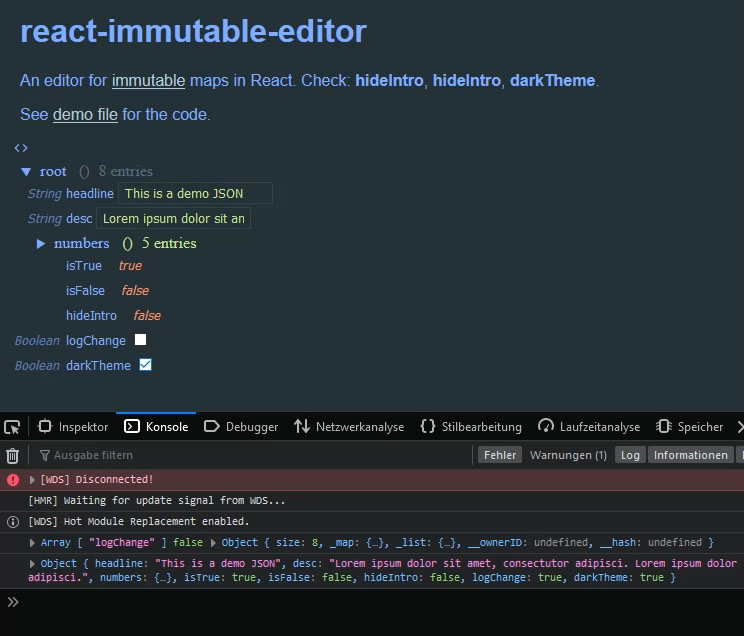

# React Immutable Editor

An editor for [immutable-js](https://immutable-js.github.io/immutable-js/docs/#/") maps in React.

See it in action:

1. Download git repo: `git clone https://bitbucket.org/bemit_eu/react-immutable-editor.git`
2. Install demo setup: `npm i`
3. Start server: `npm start`
4. Visit shown URL, default [localhost:3000](http://localhost:3000)

For usage simply `npm i --save-dev react-immutable-editor`, see [demo file](https://bitbucket.org/bemit_eu/react-immutable-editor/src/master/demo/src/index.js) for the React example.

## License

This project is free software distributed under the **MIT License**.

See: [LICENSE](LICENSE).

### Contributors

By committing your code to the code repository you agree to release the code under the MIT License attached to the repository.

***

Created by [Michael Becker](https://mlbr.xyz)
